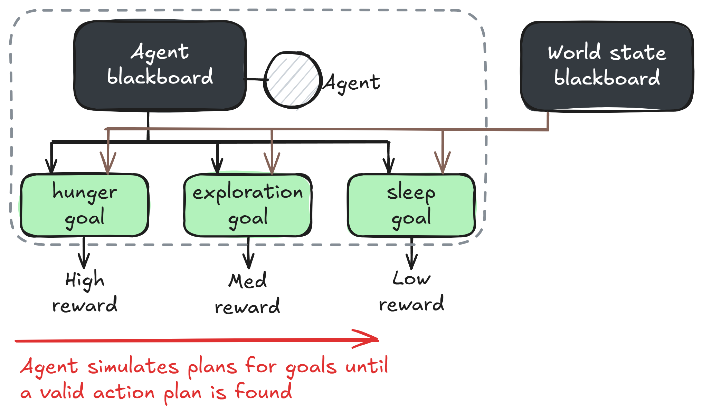
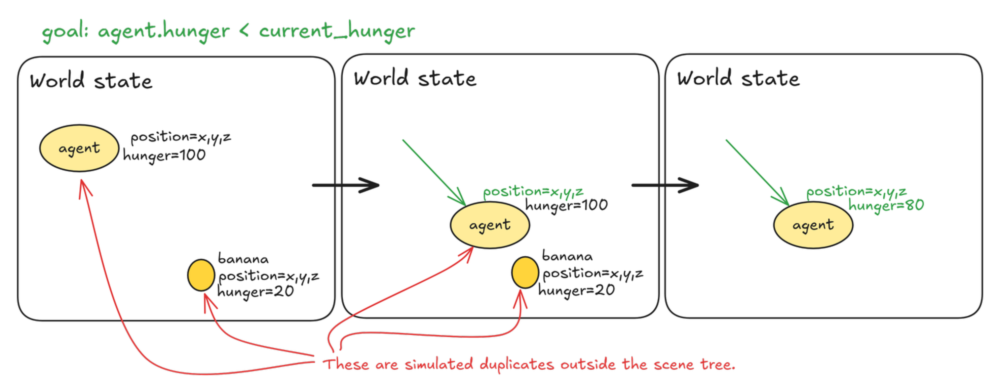
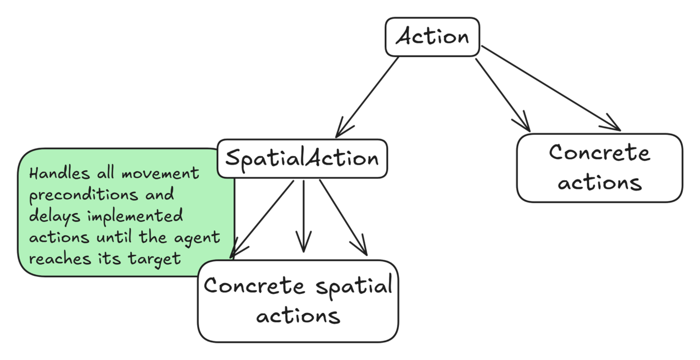

# GODOT GdPlanningAI

GdPlanningAI (**GdPAI**) is an agent planning framework that will allow you to build sophisticated AI agents for your game world.  These agents are able to reason and plan their actions in your game world based on the interactable objects within.

This framework is originally based on Goal Oriented Action Planning (GOAP), a planning system developed by Jeff Orkin in the early 2000's.  GOAP has been implemented and used in many games since; some popular titles using GOAP systems are F.E.A.R., Fallout 3, and Alien Isolation.  I originally reimplemented GOAP, but noticed some areas of improvement, and created this framework expands the planning logics and places more emphasis on interactable objects.

### Installation

This repo is set up to function as a git submodule.  If you are not familiar with using submodules to maintain addons, they help with disentangling this project's updates with your own.  This project can be added to your project directory and used without being tracked or overwritten by your own version control.  

To install this addon as a git submodule, navigate to the top of your Godot project and run:

```
git submodule add https://github.com/WahahaYes/GdPlanningAI.git addons/GdPlanningAI
```

Then, inside the project editor, go to **Project -> Project Settings -> Plugins** and enable the GdPlanningAI addon.

Release versions will also be available on the Godot asset library if you do not wish to install as a git submodule.

**Script Templates**

A number of useful templates are included in the `script_templates` folder.  They guide usage when subclassing `Action`, `Goal`, `GdPAIObjectData`, etc.  The addon **does not automatically copy these over** at the moment.  If you'd like to take advantage of these, please copy the folders inside `addons/GdPlanningAI/script_templates` to your project's templates folder (by default this is `res://script_templates`).

## Usage

In this framework, agents form chains of actions at runtime rather than relying on premade state change conditions or behavior trees.  This can greatly reduce the amount of developer overhead when designing AI behaviors, but is a more complex / less intuitive system.

**GdPAIAgent**

In this framework, each **GdPAIAgent** maintains two **GdPAIBlackboard** instances storing relevant information about their self and the broader world state.  An agent's own blackboard is used to maintain their internal attributes.  Possible attributes include *health*, *hunger*, *thirst*, *inventory*, etc.  The world state maintains common information, like *time of day* and information about interactable objects in-world (see **GdPAIObjectData** description below).

**Goal**

Agents are driven by **Goal**s.  An agent will balance however many goals it is assigned it tries to maintain based on priority.  Given the agent and world states, a reward function is computed for each goal.  When planning, the agent pursues the most rewarding goal that it is currently able to satisfy.  When designing goals, it is important to create dynamic reward functions so that the agent will prioritize different goals based on its needs (such as making a *hunger goal* reward `100 - current_hunger` to add priority the hunger the agent gets).



**Plan**

When an agent attempts to form a **Plan**, it essentially takes a snapshot of the current environment and simulates what would occur if various actions were taken.  The simulation creates temporary copies of all relevant action, blackboard, worldstate, and object data.  The copies exist outside of the scene graph, so here the planning agent is free to experiment and manipulate data attributes to test out various action sequences.

The below image gives a simple visual example for a planning sequence.  The agent's goal is to reduce hunger, which is ultimately resolved by eating food.  A prerequisite to eat food is to pick up the food, so the agent must first move towards the food.  



Note that planning actually occurs in reverse based on whether actions are viable for satisfying the plan or following actions.  This constrains the agent's exploration to only consider efficient, relevant actions.  The alternative would be a breadth-first search over a potentially huge state space.  In the above example, the agent first determined that the food on the map could decrease its hunger.  Then, the *pseudo-goal* became to determine how that food could be eaten (by going towards it!).

**Action**

Plans are formed by chaining **Action**s.  After planning, these function similarly to leaf nodes of behavior trees, in that they *do* concrete actions.  For planning, actions have an additional set of **Precondition**s which are used to determine valid actions and pathfinding chains of actions.

An **Action** has its preconditions organized via `get_validity_checks()` and `get_preconditions()`.  Validity checks are hard requirements which need to be true in order for the action to be considered at all during planning.  An example validity check is that the agent's blackboard contains a *hunger* attribute for a `eat_food` action to be considered.  

**Precondition**

Preconditions in `get_preconditions()` are dynamic and necessary for the planning logic.  These are conditions that may not be true *yet*, but could be satisfied by other actions earlier on in a plan.  In the earlier example, a precondition for an `eat_food` action may be to be holding food.  A `pickup_object` action satisfies this but has its own `object_nearby` precondition.  The `goto` action satisfies this and has no preconditions of its own (maybe `goto` had a validity check that the object in question was on the navmesh, but it is satisfied).  By chaining preconditions together, the agent found the ideal chain of `goto` -> `pickup_object` -> `eat_food`!

The **Precondition** class evaluates a lambda function `eval_func(agent_blackboard: GdPAIBlackboard, world_state: GdPAIBlackboard)`.  Please check the implemented preconditions in the example setup to get an understanding of how they can be written.  There are also a number of static functions in **Precondition** for common conditions.  **If you find yourself commonly creating preconditions of a certain format, please suggest an inclusion to the Precondition class!**

**GdObjectData**

The final major component of this framework, and the most novel improvement over GOAP, is the inclusion of **GdObjectData**.  This framework has an object-oriented approach where interactable objects broadcast the actions they provide.  Each subclass of **GdObjectData** may yield its own action and functionality, and the composition of multiple distinct **GdObjectData** nodes under a single object would result in an object that's usable in multiple ways.  

In addition to an agent's self actions, which are not dependent on external factors (for example, maybe an agent has the action to rest to regain stamina), these **GdObjectData** broadcast their relevent actions.  A `banana` may broadcast the `eat_food` action.  The relevant subclass of **GdObjectData** contains a `hunger_restored` attribute that the `eat_food` action references during simulation and while the action is being performed.  Through a validity check, the `eat_food` action can ensure that agents have a `hunger` property, to prevent unnecessary computations for agents that don't care about hunger.

The templates in `script_templates` and the demo in `examples/..` are verbosely commented to help with initial understanding of the framework.  I'd highly recommend using the script templates when creating your own actions, goals, and object data classes.

**SpatialAction**

To streamline object interactions, the **SpatialAction** class bundles agent movement to an interactable object with a concrete action.  This is a helper subclass which aims to overcome an issue brought up with the original GOAP implementation - without careful design, actions which are **strongly coupled** might explode the planning complexity.  In GOAP, the issue they ran into was with `readying` and `firing` a weapon.  A weapon **always has to be ready before it can be fired**, so having these as separate actions greatly expanded the search space.  In prototyping, I noticed the same for `goto` and `object interactions`.  The agent will almost definitely want to approach the object first, but with the option to *go anywhere during planning*, it became very difficult for the agent to determine where it should be.  **SpatialAction** handles the logic for movement, then the subclass's implementation kicks in when the agent arrives at the object.



The **SpatialAction** class adapts to 2D or 3D depending on the location node specified on the object's **GdPAILocationData**.  **SpatialAction** has its own `script_template` that is expanded and highly recommended to use.

### License

Copyright 2025 Ethan Wilson

This work is licensed under the Apache License, Version 2.0.  The license file can be viewed at [LICENSE.md](LICENSE.md) and at [http://www.apache.org/licenses/LICENSE-2.0](http://www.apache.org/licenses/LICENSE-2.0).  Note that this license requires attribution within any derivative works (I want to be credited!), the license must be redistributed with derivative works, and any modified files must contain notices that they have been changed from the original material.

### TODOs

The framework is stable for creating planning agents but is still in an early phase of development.  I plan to make additions as I work on my game projects, and **I am open to feedback or contributions from the community!**  Please raise issues on the Github to discuss any bugs or requested features, and feel free to fork the repo and make pull requests with any additions.

Here is a running list of todo items *(if anyone wants to claim one, like logo or sprite artwork, please let me know!)*:

- Making a project logo!
- Making icons for the custom nodes that have been introduced.  Not that important for functionality, but they'd look nice!
- Updating the demo scene's assets.  I threw together some very quick pixel art so that I wouldn't need to worry about licensing issues, but they could use an upgrade!
- Creating a visual debugger similar to Beehave or LimboAI's debuggers for behavior trees.
- Multithreaded agent planning.  In simple contexts this may not be needed, but longer planning sequences could bottleneck the main thread and lead to stutters.  Single or multithreading will be specifiable per agent.
- A more complicated demo scene.  Because the current demo uses **SpatialAction**s, which bundle movement in with eating, the actual planning is very simple, most plans contain a single action.
- Tutorial video.

### FAQs

Ask me questions!  If broadly relevant I'll add the Q&A here!